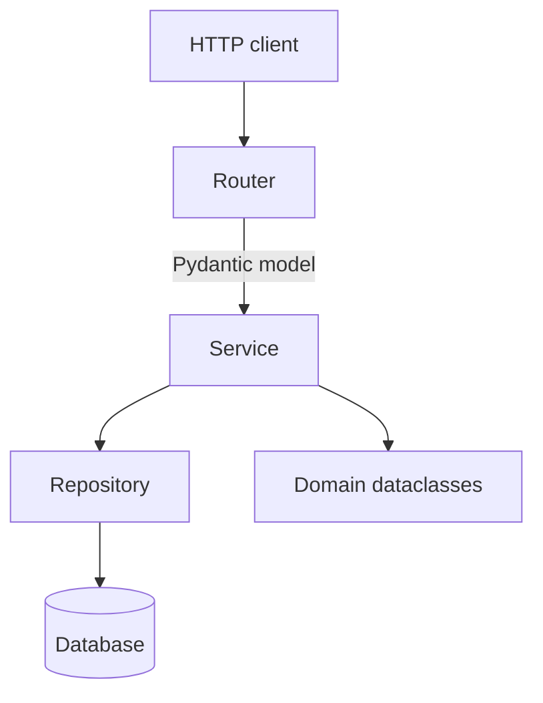

# System Patterns — FastAPI 0.110

Pre-populated by `engineering-standards-central`. Augment with service-specific
patterns (e.g., event-sourcing details, sharding strategy, idempotency design).

## Layered Architecture

## Layer Boundaries

- Routers (routers/, api/) depend only on services.
- Services own business logic and remain testable without FastAPI imports.
- Repositories handle persistence only.

## Cross-Cutting Concerns

Logging, tracing, security, and error handling are governed by the canonical
engineering standards (see `.cursor/rules/`, `CLAUDE.md`, `AGENTS.md`).
