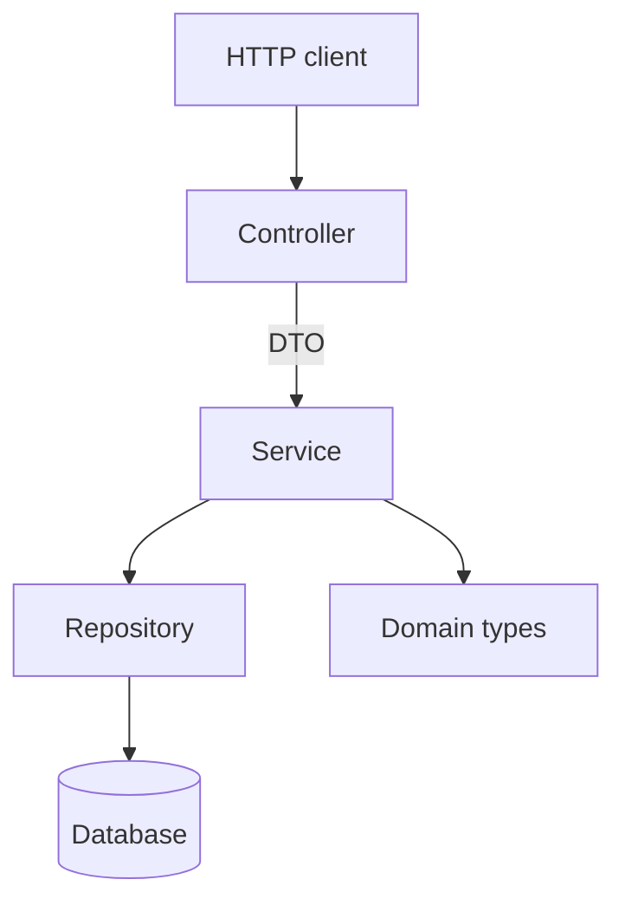

# System Patterns — NestJS 10

Pre-populated by `engineering-standards-central`. Augment with service-specific
patterns (e.g., event-sourcing details, sharding strategy, idempotency design).

## Layered Architecture

## Layer Boundaries

- Controllers (.controller.ts) depend only on services; never inject Repository types.
- Services (.service.ts) own business logic; controllers stay thin.
- Repositories handle persistence only; no business rules.

## Cross-Cutting Concerns

Logging, tracing, security, and error handling are governed by the canonical
engineering standards (see `.cursor/rules/`, `CLAUDE.md`, `AGENTS.md`).
